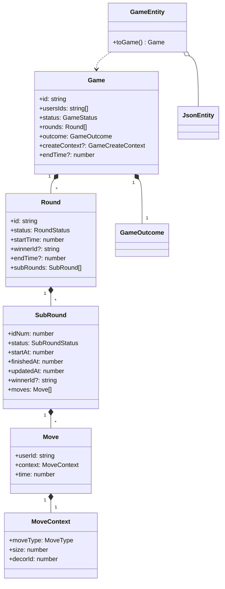

# VKP REST API Documentation

## Overview

The VKP REST API is a comprehensive file, user, and game management system built with AWS Lambda, providing CRUD operations for JSON documents, user entities, and game entities. The API follows RESTful principles with proper HTTP status codes, ETag-based concurrency control, and RFC 7807 problem+json error responses.

## Base URL

**Production (via CloudFront)**:
```
https://vkp-consulting.fr
```

**Direct API Gateway** (for testing):
```
https://wmrksdxxml.execute-api.eu-north-1.amazonaws.com
```

## Authentication

Cognito ID token in `Authorization: Bearer <token>`. Layers: [AUTH.md](../AUTH.md).

| Prefix | API Gateway JWT | Lambda |
|--------|-----------------|--------|
| `/apiv2/public/*` | off | none |
| `/apiv2/external/*` | on | any authenticated role |
| `/apiv2/internal/*` | on | `admin` (`requireRole`) |

Missing/invalid token on protected routes: **401** (Gateway or RFC 7807). Wrong role: **403**. Simple API `/api/*` has no Cognito.

## Content Types

- **Request Content-Type**: `application/json` (required for POST, PUT, PATCH)
- **Response Content-Type**: `application/json`
- **Error Content-Type**: `application/problem+json` (RFC 7807)

## CORS

The API supports CORS with the following configuration:
- **Allowed Origin**: `https://vkp-consulting.fr` (configurable)
- **Allowed Methods**: `GET, POST, PUT, PATCH, DELETE, OPTIONS`
- **Allowed Headers**: `Content-Type, Authorization, If-Match, If-None-Match`

---

## API Endpoints Summary

| Resource | Endpoint | Methods | Who |
|----------|----------|---------|-----|
| Create guest | `/apiv2/public/create-guest` | POST | open |
| Login | `/apiv2/public/login` | POST | open |
| Current user | `/apiv2/external/me` | GET | any JWT |
| Promote guest | `/apiv2/external/promote` | POST | JWT guest |
| Player games | `/apiv2/external/games`, `/apiv2/external/games/{gameId}` | POST, GET, PUT, PATCH | any JWT |
| **Files** | `/apiv2/internal/files` | GET, POST | admin |
| **File** | `/apiv2/internal/files/{id}` | GET, PUT, PATCH, DELETE | admin |
| **File Meta** | `/apiv2/internal/files/{id}/meta` | GET | admin |
| **Users** | `/apiv2/internal/users` | GET, POST | admin |
| **User** | `/apiv2/internal/users/{id}` | GET, PUT, PATCH, DELETE | admin |
| **User Meta** | `/apiv2/internal/users/{id}/meta` | GET | admin |
| **Games** | `/apiv2/internal/games` | GET, POST | admin |
| **Game** | `/apiv2/internal/games/{id}` | GET, PUT, PATCH, DELETE | admin |
| **Game Meta** | `/apiv2/internal/games/{id}/meta` | GET | admin |
| **Game Rounds** | `/apiv2/internal/games/{id}/rounds` | POST | admin |
| **Round Moves** | `/apiv2/internal/games/{gameId}/rounds/{roundId}/moves` | POST | admin |
| **Finish Round** | `/apiv2/internal/games/{gameId}/rounds/{roundId}/finish` | PATCH | admin |
| **Finish Game** | `/apiv2/internal/games/{id}/finish` | PATCH | admin |

There are no `/apiv2/files` or `/apiv2/games` routes (those 401 at the JWT authorizer).

---

## Domain model

Layered DDD: presentation → application (services + DTOs) → domain → S3 repositories. Full class diagrams: [src/domain/CLASS_DIAGRAM.md](src/domain/CLASS_DIAGRAM.md). Create/play/surrender flow: [src/domain/GAME_FLOW.md](src/domain/GAME_FLOW.md). Rewards: [src/domain/value-object/GameOutcome-diagram.md](src/domain/value-object/GameOutcome-diagram.md).



`GameEntity` / `UserEntity` wrap `JsonEntity` (S3 JSON + ETag) and delegate rules to `Game` / `UserProfile`. Moves live on `SubRound`, not `Round`.

| Enum | Values |
|------|--------|
| `GameStatus` | `created`, `started`, `finished`, `broken` |
| `GameTypeLength` (`Medal.gameLength`) | `BO1`, `BO3`, `BO5`, `BO7`, `BO9`, `BO11`, `BO19` |
| `RoundStatus` | `pending`, `current`, `finished` |
| `SubRoundStatus` | `init`, `wait_player`, `done`, `surrendered` |
| `MoveType` | `Stone`, `Paper`, `Scissors` |
| `ActionType` (player update) | `Move`, `Surrender` |
| `GameType` (create context) | `PVP`, `PVE` |
| `RoundsLength` (create context) | `BO1`, `BO3`, `BO7` |
| `KindOfGame` | `classic` (same `MoveType` is always a draw; `size` unused), `extended` (same `MoveType`: higher `size` wins, equal `size` is a draw; different types ignore `size`) |

Two HTTP shapes for the same aggregate:

| Surface | Path | Game body |
|---------|------|-----------|
| Player processor | `/apiv2/external/games` | `GameCreateContext` in; `payload` with `roundStates` / `subRoundStates` out |
| Admin CRUD | `/apiv2/internal/games` | Legacy DTO: rounds still send `moves` + `isFinished`; responses flatten all sub-round moves onto the round |

---

## Public API (`/apiv2/public`)

No JWT. CORS + JSON body.

### Create guest

**POST** `/apiv2/public/create-guest`

Empty body. Cognito `AdminCreateUser` with a `@vkp.local` email, then `USER_PASSWORD_AUTH`. Returns `guestEmail` and `tokens` (`idToken`, `accessToken`, `refreshToken`, `expiresIn`).

### Login

**POST** `/apiv2/public/login`

```json
{ "email": "user@example.com", "password": "..." }
```

Returns the same `tokens` object. Bad credentials: `401` `INVALID_CREDENTIALS`.

---

## External API (`/apiv2/external`)

JWT, any role. Header: `Authorization: Bearer <idToken>`.

### Current user

**GET** `/apiv2/external/me` — user profile for the token `sub` (creates the User entity if missing).

### Promote guest

**POST** `/apiv2/external/promote`

```json
{ "email": "real@example.com", "password": "...", "displayName": "Optional" }
```

Caller must be a guest (`@vkp.local` or group `guest`).

### Player games

Processor API (`GameProcessorService`). Not the admin CRUD body. Opponent is `NPC_1`. Created games persist `type: "BO7"` today even when `rounds` in the create context is `BO1` or `BO3`.

#### Create game

**POST** `/apiv2/external/games`

```json
{
  "gameType": "PVE",
  "rounds": "BO7",
  "kind": "classic",
  "level": { "name": "1" },
  "episode": { "name": "intro" }
}
```

| Field | Type | Required | Values |
|-------|------|----------|--------|
| `gameType` | string | Yes | `PVP`, `PVE` |
| `rounds` | string | Yes | `BO1`, `BO3`, `BO7` |
| `kind` | string | Yes | `classic` (same type is a draw; `size` unused), `extended` (same type compares `size`; different types ignore `size`) |
| `level.name` | string | Yes | non-empty |
| `episode.name` | string | Yes | non-empty |

**Success (200)**:

```json
{ "status": "created", "gameId": "game-1697123456789-abc1234" }
```

#### Get game

**GET** `/apiv2/external/games/{gameId}`

```json
{
  "status": "ok",
  "payload": {
    "gameContext": {
      "status": "created",
      "initGameContext": {
        "gameType": "PVE",
        "rounds": "BO7",
        "kind": "classic",
        "level": { "name": "1" },
        "episode": { "name": "intro" }
      }
    },
    "playerContext": {
      "roundStates": [
        {
          "status": "current",
          "started": "2026-09-02T20:00:00.000Z",
          "finished": null,
          "roundId": "round-1",
          "winnerId": null,
          "subRoundStates": [
            {
              "idNum": 1,
              "status": "wait_player",
              "started": "2026-09-02T20:00:00.000Z",
              "finished": null,
              "updated": "2026-09-02T20:00:00.000Z",
              "winnerId": null,
              "moves": []
            }
          ]
        }
      ]
    },
    "enemyContext": {}
  }
}
```

`roundStates` / `subRoundStates` are presentation objects (`RoundState`, `SubRoundState`). Move objects use `userId`, `context.moveType` (`Stone` \| `Paper` \| `Scissors`), `context.size`, `context.decorId`, `time`.

#### Update game (action)

**PUT** or **PATCH** `/apiv2/external/games/{gameId}`

```json
{
  "type": "Move",
  "context": {
    "move": {
      "userId": "<jwt-sub>",
      "context": { "moveType": "Stone", "size": 0, "decorId": 0 },
      "time": 1697123456789
    }
  }
}
```

`type` is `Move` or `Surrender`. Response is `status`, `gameId`, `payload` (same shape as GET), and `message`.

---

## Files API (`/apiv2/internal/files`)

The Files API provides unified management for JSON documents, user entity files, and game files. It can read from `json/`, `json/users/`, and `json/games/` folders, providing a single interface for all file types.

### List Files

**GET** `/apiv2/internal/files`

Retrieve a paginated list of all files (including both regular JSON files and user files).

#### Query Parameters

| Parameter | Type | Default | Description |
|-----------|------|---------|-------------|
| `limit` | number | 100 | Maximum number of files to return (1-1000) |
| `cursor` | string | - | Base64-encoded cursor for pagination |
| `prefix` | string | - | Filter files by prefix |

#### Response

```json
{
  "names": ["file1", "file2", "user-123"],
  "nextCursor": "eyJuZXh0VG9rZW4iOiIxMjMifQ=="
}
```

#### Example

```bash
curl -X GET "https://vkp-consulting.fr/apiv2/internal/files?limit=10"
```

---

### Get File

**GET** `/apiv2/internal/files/{id}`

Retrieve a specific file by its ID. Works for both regular JSON files and user files.

#### Path Parameters

| Parameter | Type | Required | Description |
|-----------|------|----------|-------------|
| `id` | string | Yes | File identifier (alphanumeric, dots, hyphens, underscores, 1-128 chars) |

#### Headers

| Header | Type | Required | Description |
|--------|------|----------|-------------|
| `If-None-Match` | string | No | ETag to check if file has been modified |

#### Response

**Success (200)**:
```json
{
  "id": "file-123",
  "data": {
    "key": "value",
    "nested": {
      "property": "data"
    }
  }
}
```

**Not Modified (304)**: When `If-None-Match` matches current ETag

#### Response Headers

| Header | Description |
|--------|-------------|
| `ETag` | Entity tag for concurrency control |
| `Cache-Control` | `private, must-revalidate` |

#### Example

```bash
curl -X GET "https://vkp-consulting.fr/apiv2/internal/files/config" \
  -H "If-None-Match: \"abc123\""
```

---

### Get File Metadata

**GET** `/apiv2/internal/files/{id}/meta`

Retrieve metadata for a specific file without downloading the content.

#### Path Parameters

| Parameter | Type | Required | Description |
|-----------|------|----------|-------------|
| `id` | string | Yes | File identifier |

#### Response

```json
{
  "etag": "\"abc123def456\"",
  "size": 1024,
  "lastModified": "2023-10-12T18:30:00.000Z"
}
```

#### Example

```bash
curl -X GET "https://vkp-consulting.fr/apiv2/internal/files/config/meta"
```

---

### Create File

**POST** `/apiv2/internal/files`

Create a new file with the specified ID and data.

#### Request Body

```json
{
  "id": "new-file",
  "data": {
    "content": "any valid JSON structure",
    "metadata": {
      "version": "1.0"
    }
  }
}
```

#### Headers

| Header | Type | Required | Description |
|--------|------|----------|-------------|
| `Content-Type` | string | Yes | Must be `application/json` |
| `If-None-Match` | string | No | Set to `*` to ensure file doesn't exist |

#### Response

**Success (201)**:
```json
{
  "id": "new-file",
  "data": {
    "content": "any valid JSON structure",
    "metadata": {
      "version": "1.0"
    }
  }
}
```

#### Response Headers

| Header | Description |
|--------|-------------|
| `Location` | URL of the created file |
| `ETag` | Entity tag for the created file |

#### Example

```bash
curl -X POST "https://vkp-consulting.fr/apiv2/internal/files" \
  -H "Content-Type: application/json" \
  -H "If-None-Match: *" \
  -d '{
    "id": "config",
    "data": {
      "database": {
        "host": "localhost",
        "port": 5432
      },
      "features": ["auth", "logging"]
    }
  }'
```

---

### Update File (Replace)

**PUT** `/apiv2/internal/files/{id}`

Replace the entire content of a file.

#### Path Parameters

| Parameter | Type | Required | Description |
|-----------|------|----------|-------------|
| `id` | string | Yes | File identifier |

#### Request Body

```json
{
  "key": "new value",
  "completely": "new structure"
}
```

#### Headers

| Header | Type | Required | Description |
|--------|------|----------|-------------|
| `Content-Type` | string | Yes | Must be `application/json` |
| `If-Match` | string | No | ETag to ensure file hasn't been modified |

#### Response

**Success (200)**:
```json
{
  "id": "file-123",
  "data": {
    "key": "new value",
    "completely": "new structure"
  }
}
```

#### Example

```bash
curl -X PUT "https://vkp-consulting.fr/apiv2/internal/files/config" \
  -H "Content-Type: application/json" \
  -H "If-Match: \"abc123\"" \
  -d '{
    "database": {
      "host": "production-db",
      "port": 5432
    },
    "features": ["auth", "logging", "monitoring"]
  }'
```

---

### Update File (Merge)

**PATCH** `/apiv2/internal/files/{id}`

Partially update a file by merging new data with existing content.

#### Path Parameters

| Parameter | Type | Required | Description |
|-----------|------|----------|-------------|
| `id` | string | Yes | File identifier |

#### Request Body

```json
{
  "merge": true,
  "data": {
    "newField": "value",
    "existingField": "updated value"
  }
}
```

#### Headers

| Header | Type | Required | Description |
|--------|------|----------|-------------|
| `Content-Type` | string | Yes | Must be `application/json` |
| `If-Match` | string | No | ETag to ensure file hasn't been modified |

#### Response

**Success (200)**:
```json
{
  "id": "file-123",
  "data": {
    "existingField": "updated value",
    "newField": "value",
    "otherExistingField": "preserved"
  }
}
```

#### Example

```bash
curl -X PATCH "https://vkp-consulting.fr/apiv2/internal/files/config" \
  -H "Content-Type: application/json" \
  -H "If-Match: \"abc123\"" \
  -d '{
    "merge": true,
    "data": {
      "database": {
        "host": "new-host"
      },
      "newFeature": "enabled"
    }
  }'
```

---

### Delete File

**DELETE** `/apiv2/internal/files/{id}`

Delete a file permanently.

#### Path Parameters

| Parameter | Type | Required | Description |
|-----------|------|----------|-------------|
| `id` | string | Yes | File identifier |

#### Headers

| Header | Type | Required | Description |
|--------|------|----------|-------------|
| `If-Match` | string | No | ETag to ensure file hasn't been modified |

#### Response

**Success (204)**: No content

#### Example

```bash
curl -X DELETE "https://vkp-consulting.fr/apiv2/internal/files/old-config" \
  -H "If-Match: \"abc123\""
```

---

## Users API (`/apiv2/internal/users`)

The Users API provides specialized management for user entities with structured data validation.

### List Users

**GET** `/apiv2/internal/users`

Retrieve a paginated list of all users.

#### Query Parameters

| Parameter | Type | Default | Description |
|-----------|------|---------|-------------|
| `limit` | number | 100 | Maximum number of users to return (1-1000) |
| `cursor` | string | - | Base64-encoded cursor for pagination |
| `prefix` | string | - | Filter users by ID prefix |

#### Response

```json
{
  "names": ["user-001", "user-002", "admin-123"],
  "nextCursor": "eyJuZXh0VG9rZW4iOiIxMjMifQ=="
}
```

#### Example

```bash
curl -X GET "https://vkp-consulting.fr/apiv2/internal/users?limit=20"
```

---

### Get User

**GET** `/apiv2/internal/users/{id}`

Retrieve a specific user by ID.

#### Path Parameters

| Parameter | Type | Required | Description |
|-----------|------|----------|-------------|
| `id` | string | Yes | User identifier (alphanumeric, dots, hyphens, underscores, 1-128 chars) |

#### Headers

| Header | Type | Required | Description |
|--------|------|----------|-------------|
| `If-None-Match` | string | No | ETag to check if user has been modified |

#### Response

**Success (200)**:
```json
{
  "id": "user-123",
  "name": "John Doe",
  "externalId": 1001
}
```

**Not Modified (304)**: When `If-None-Match` matches current ETag

#### Response Headers

| Header | Description |
|--------|-------------|
| `ETag` | Entity tag for concurrency control |
| `Cache-Control` | `private, max-age=300` |

#### Example

```bash
curl -X GET "https://vkp-consulting.fr/apiv2/internal/users/user-123" \
  -H "If-None-Match: \"abc123\""
```

---

### Get User Metadata

**GET** `/apiv2/internal/users/{id}/meta`

Retrieve metadata for a specific user without downloading the content.

#### Path Parameters

| Parameter | Type | Required | Description |
|-----------|------|----------|-------------|
| `id` | string | Yes | User identifier |

#### Response

```json
{
  "etag": "\"abc123def456\"",
  "size": 45,
  "lastModified": "2023-10-12T18:30:00.000Z"
}
```

#### Example

```bash
curl -X GET "https://vkp-consulting.fr/apiv2/internal/users/user-123/meta"
```

---

### Create User

**POST** `/apiv2/internal/users`

Create a new user with the specified ID, name, and external ID.

#### Request Body

```json
{
  "id": "user-123",
  "name": "John Doe",
  "externalId": 1001
}
```

#### Field Validation

| Field | Type | Required | Constraints |
|-------|------|----------|-------------|
| `id` | string | Yes | 1-128 chars, alphanumeric + dots, hyphens, underscores |
| `name` | string | Yes | 2-100 characters |
| `externalId` | number | Yes | Positive integer |

#### Headers

| Header | Type | Required | Description |
|--------|------|----------|-------------|
| `Content-Type` | string | Yes | Must be `application/json` |
| `If-None-Match` | string | No | Set to `*` to ensure user doesn't exist |

#### Response

**Success (201)**:
```json
{
  "id": "user-123",
  "name": "John Doe",
  "externalId": 1001
}
```

#### Response Headers

| Header | Description |
|--------|-------------|
| `Location` | URL of the created user |
| `ETag` | Entity tag for the created user |

#### Example

```bash
curl -X POST "https://vkp-consulting.fr/apiv2/internal/users" \
  -H "Content-Type: application/json" \
  -H "If-None-Match: *" \
  -d '{
    "id": "user-456",
    "name": "Jane Smith",
    "externalId": 2002
  }'
```

---

### Update User (Replace)

**PUT** `/apiv2/internal/users/{id}`

Replace the entire user data.

#### Path Parameters

| Parameter | Type | Required | Description |
|-----------|------|----------|-------------|
| `id` | string | Yes | User identifier |

#### Request Body

```json
{
  "name": "John Smith",
  "externalId": 1002
}
```

#### Headers

| Header | Type | Required | Description |
|--------|------|----------|-------------|
| `Content-Type` | string | Yes | Must be `application/json` |
| `If-Match` | string | No | ETag to ensure user hasn't been modified |

#### Response

**Success (200)**:
```json
{
  "id": "user-123",
  "name": "John Smith",
  "externalId": 1002
}
```

#### Example

```bash
curl -X PUT "https://vkp-consulting.fr/apiv2/internal/users/user-123" \
  -H "Content-Type: application/json" \
  -H "If-Match: \"abc123\"" \
  -d '{
    "name": "John Smith",
    "externalId": 1002
  }'
```

---

### Update User (Merge)

**PATCH** `/apiv2/internal/users/{id}`

Partially update a user by merging new data with existing content.

#### Path Parameters

| Parameter | Type | Required | Description |
|-----------|------|----------|-------------|
| `id` | string | Yes | User identifier |

#### Request Body

```json
{
  "merge": true,
  "data": {
    "name": "John Smith"
  }
}
```

#### Headers

| Header | Type | Required | Description |
|--------|------|----------|-------------|
| `Content-Type` | string | Yes | Must be `application/json` |
| `If-Match` | string | No | ETag to ensure user hasn't been modified |

#### Response

**Success (200)**:
```json
{
  "id": "user-123",
  "name": "John Smith",
  "externalId": 1001
}
```

#### Example

```bash
curl -X PATCH "https://vkp-consulting.fr/apiv2/internal/users/user-123" \
  -H "Content-Type: application/json" \
  -H "If-Match: \"abc123\"" \
  -d '{
    "merge": true,
    "data": {
      "name": "John Smith"
    }
  }'
```

---

### Delete User

**DELETE** `/apiv2/internal/users/{id}`

Delete a user permanently.

#### Path Parameters

| Parameter | Type | Required | Description |
|-----------|------|----------|-------------|
| `id` | string | Yes | User identifier |

#### Headers

| Header | Type | Required | Description |
|--------|------|----------|-------------|
| `If-Match` | string | No | ETag to ensure user hasn't been modified |

#### Response

**Success (204)**: No content

#### Example

```bash
curl -X DELETE "https://vkp-consulting.fr/apiv2/internal/users/user-123" \
  -H "If-Match: \"abc123\""
```

---

## Games API (`/apiv2/internal/games`)

Admin CRUD for the same `Game` aggregate. Zod still accepts a **legacy round DTO** (`moves` on the round, `isFinished`, numeric `winnerId`). On write, those moves are wrapped in one `SubRound`. On read, `GameResponseDto` flattens every sub-round's moves back onto the round and maps `GameStatus` / `RoundStatus` to `isFinished`. Match length lives on `createContext.rounds` (`RoundsLength`), not on the admin DTO.

### List Games

**GET** `/apiv2/internal/games`

Retrieve a paginated list of all games.

#### Query Parameters

| Parameter | Type | Default | Description |
|-----------|------|---------|-------------|
| `limit` | number | 100 | Maximum number of games to return (1-1000) |
| `cursor` | string | - | Base64-encoded cursor for pagination |
| `prefix` | string | - | Filter games by ID prefix |

#### Response

```json
{
  "names": ["game-001", "game-002", "game-123"],
  "nextCursor": "eyJuZXh0VG9rZW4iOiIxMjMifQ=="
}
```

#### Example

```bash
curl -X GET "https://vkp-consulting.fr/apiv2/internal/games?limit=20"
```

---

### Get Game

**GET** `/apiv2/internal/games/{id}`

Retrieve a specific game by ID. Response is the flattened admin DTO (`isFinished`, moves on the round).

#### Path Parameters

| Parameter | Type | Required | Description |
|-----------|------|----------|-------------|
| `id` | string | Yes | Game identifier (alphanumeric, dots, hyphens, underscores, 1-128 chars) |

#### Headers

| Header | Type | Required | Description |
|--------|------|----------|-------------|
| `If-None-Match` | string | No | ETag to check if game has been modified |

#### Response

**Success (200)**:
```json
{
  "id": "game-123",
  "usersIds": ["user-001", "user-002"],
  "rounds": [
    {
      "id": "round-1",
      "moves": [
        {
          "userId": "user-001",
          "context": { "moveType": "Stone", "size": 0, "decorId": 0 },
          "time": 1697123456789
        }
      ],
      "isFinished": false
    }
  ],
  "isFinished": false,
  "etag": "\"abc123\"",
  "metadata": { "etag": "\"abc123\"", "size": 512, "lastModified": "2026-09-02T18:30:00.000Z" }
}
```

**Not Modified (304)**: When `If-None-Match` matches current ETag

#### Response Headers

| Header | Description |
|--------|-------------|
| `ETag` | Entity tag for concurrency control |
| `Cache-Control` | `private, must-revalidate` |

#### Example

```bash
curl -X GET "https://vkp-consulting.fr/apiv2/internal/games/game-123" \
  -H "If-None-Match: \"abc123\""
```

---

### Get Game Metadata

**GET** `/apiv2/internal/games/{id}/meta`

Retrieve metadata for a specific game without downloading the content.

#### Path Parameters

| Parameter | Type | Required | Description |
|-----------|------|----------|-------------|
| `id` | string | Yes | Game identifier |

#### Response

```json
{
  "etag": "\"abc123def456\"",
  "size": 512,
  "lastModified": "2023-10-12T18:30:00.000Z"
}
```

#### Example

```bash
curl -X GET "https://vkp-consulting.fr/apiv2/internal/games/game-123/meta"
```

---

### Create Game

**POST** `/apiv2/internal/games`

Create a new game with the specified ID, users, rounds, and finished flag.

#### Request Body

```json
{
  "id": "game-123",
  "usersIds": ["user-001", "user-002"],
  "rounds": [],
  "isFinished": false
}
```

#### Field Validation

| Field | Type | Required | Constraints |
|-------|------|----------|-------------|
| `id` | string | Yes | 1-128 chars, alphanumeric + dots, hyphens, underscores |
| `usersIds` | string[] | Yes | 1-10 unique user IDs |
| `rounds` | Round[] | No | Array of legacy round objects (default: []) |
| `isFinished` | boolean | No | Default: false. Mapped to `GameStatus.finished` or `created` |

**Round Object** (write DTO; stored as one `SubRound` containing `moves`):
| Field | Type | Required | Constraints |
|-------|------|----------|-------------|
| `id` | string | Yes | 1-128 chars, alphanumeric + dots, hyphens, underscores |
| `moves` | Move[] | No | Array of move objects (default: []) |
| `isFinished` | boolean | No | Default: false. Mapped to `RoundStatus.finished` or `pending` |
| `startTime` | number | No | Unix timestamp in milliseconds (default: now) |
| `endTime` | number | No | Unix timestamp in milliseconds |
| `winnerId` | number | No | Coerced to string on persist (`Round.winnerId` is a user id string) |

**Move Object**:
| Field | Type | Required | Constraints |
|-------|------|----------|-------------|
| `userId` | string | Yes | Valid user ID pattern |
| `context.moveType` | string | Yes | `Stone`, `Paper`, `Scissors` |
| `context.size` | number | Yes | Non-negative integer |
| `context.decorId` | number | Yes | Non-negative integer |
| `time` | number | No | Unix timestamp in milliseconds (default: now) |

#### Headers

| Header | Type | Required | Description |
|--------|------|----------|-------------|
| `Content-Type` | string | Yes | Must be `application/json` |
| `If-None-Match` | string | No | Set to `*` to ensure game doesn't exist |

#### Response

**Success (201)**:
```json
{
  "id": "game-123",
  "usersIds": ["user-001", "user-002"],
  "rounds": [],
  "isFinished": false
}
```

#### Response Headers

| Header | Description |
|--------|-------------|
| `Location` | URL of the created game |
| `ETag` | Entity tag for the created game |

#### Example

```bash
curl -X POST "https://vkp-consulting.fr/apiv2/internal/games" \
  -H "Content-Type: application/json" \
  -H "If-None-Match: *" \
  -d '{
    "id": "game-123",
    "usersIds": ["player1", "player2"],
    "rounds": [],
    "isFinished": false
  }'
```

---

### Update Game (Replace)

**PUT** `/apiv2/internal/games/{id}`

Replace the entire game data. Replace requires `usersIds`, `rounds`, and `isFinished`.

#### Path Parameters

| Parameter | Type | Required | Description |
|-----------|------|----------|-------------|
| `id` | string | Yes | Game identifier |

#### Request Body

```json
{
  "usersIds": ["user-001", "user-002", "user-003"],
  "rounds": [
    {
      "id": "round-1",
      "moves": [],
      "isFinished": false,
      "startTime": 1697123456789
    }
  ],
  "isFinished": false
}
```

#### Headers

| Header | Type | Required | Description |
|--------|------|----------|-------------|
| `Content-Type` | string | Yes | Must be `application/json` |
| `If-Match` | string | No | ETag to ensure game hasn't been modified |

#### Response

**Success (200)**:
```json
{
  "id": "game-123",
  "usersIds": ["user-001", "user-002", "user-003"],
  "rounds": [
    {
      "id": "round-1",
      "moves": [],
      "isFinished": false
    }
  ],
  "isFinished": false
}
```

#### Example

```bash
curl -X PUT "https://vkp-consulting.fr/apiv2/internal/games/game-123" \
  -H "Content-Type: application/json" \
  -H "If-Match: \"abc123\"" \
  -d '{
    "usersIds": ["user-001", "user-002", "user-003"],
    "rounds": [],
    "isFinished": false
  }'
```

---

### Update Game (Merge)

**PATCH** `/apiv2/internal/games/{id}`

Partially update a game. Body is the same fields as PUT, all optional (`UpdateGameDto`). There is no `{ "merge": true, "data": ... }` wrapper.

#### Path Parameters

| Parameter | Type | Required | Description |
|-----------|------|----------|-------------|
| `id` | string | Yes | Game identifier |

#### Request Body

```json
{
  "isFinished": true
}
```

#### Headers

| Header | Type | Required | Description |
|--------|------|----------|-------------|
| `Content-Type` | string | Yes | Must be `application/json` |
| `If-Match` | string | No | ETag to ensure game hasn't been modified |

#### Response

**Success (200)**:
```json
{
  "id": "game-123",
  "usersIds": ["user-001", "user-002"],
  "rounds": [
    {
      "id": "round-1",
      "moves": [],
      "isFinished": false
    }
  ],
  "isFinished": true
}
```

#### Example

```bash
curl -X PATCH "https://vkp-consulting.fr/apiv2/internal/games/game-123" \
  -H "Content-Type: application/json" \
  -H "If-Match: \"abc123\"" \
  -d '{
    "isFinished": true
  }'
```

---

### Delete Game

**DELETE** `/apiv2/internal/games/{id}`

Delete a game permanently.

#### Path Parameters

| Parameter | Type | Required | Description |
|-----------|------|----------|-------------|
| `id` | string | Yes | Game identifier |

#### Headers

| Header | Type | Required | Description |
|--------|------|----------|-------------|
| `If-Match` | string | No | ETag to ensure game hasn't been modified |

#### Response

**Success (204)**: No content

#### Example

```bash
curl -X DELETE "https://vkp-consulting.fr/apiv2/internal/games/old-game" \
  -H "If-Match: \"abc123\""
```

---

### Add Round to Game

**POST** `/apiv2/internal/games/{id}/rounds`

Add a new round. Body is the legacy round DTO; moves are stored in a single `SubRound`.

#### Path Parameters

| Parameter | Type | Required | Description |
|-----------|------|----------|-------------|
| `id` | string | Yes | Game identifier |

#### Request Body

```json
{
  "id": "round-2",
  "moves": [],
  "isFinished": false,
  "startTime": 1697123456789
}
```

#### Headers

| Header | Type | Required | Description |
|--------|------|----------|-------------|
| `Content-Type` | string | Yes | Must be `application/json` |
| `If-Match` | string | No | ETag to ensure game hasn't been modified |

#### Response

**Success (200)**:
```json
{
  "id": "game-123",
  "usersIds": ["user-001", "user-002"],
  "rounds": [
    {
      "id": "round-1",
      "moves": [],
      "isFinished": true
    },
    {
      "id": "round-2",
      "moves": [],
      "isFinished": false
    }
  ],
  "isFinished": false
}
```

#### Example

```bash
curl -X POST "https://vkp-consulting.fr/apiv2/internal/games/game-123/rounds" \
  -H "Content-Type: application/json" \
  -H "If-Match: \"abc123\"" \
  -d '{
    "id": "round-2",
    "moves": [],
    "isFinished": false,
    "startTime": 1697123456789
  }'
```

---

### Add Move to Round

**POST** `/apiv2/internal/games/{gameId}/rounds/{roundId}/moves`

This route still exists, but `Game.addMoveToRound` throws: moves must be added on a `SubRound`. Use PUT/PATCH of the game, or the player processor (`POST`/`PUT` `/apiv2/external/games`), until this admin path is rewired.

#### Path Parameters

| Parameter | Type | Required | Description |
|-----------|------|----------|-------------|
| `gameId` | string | Yes | Game identifier |
| `roundId` | string | Yes | Round identifier |

#### Request Body

```json
{
  "userId": "user-001",
  "context": { "moveType": "Stone", "size": 0, "decorId": 0 },
  "time": 1697123456789
}
```

#### Headers

| Header | Type | Required | Description |
|--------|------|----------|-------------|
| `Content-Type` | string | Yes | Must be `application/json` |
| `If-Match` | string | No | ETag to ensure game hasn't been modified |

#### Response

**Success (200)**: flattened admin game DTO (not currently reachable; domain throws `addMoveToRound is no longer supported`).

#### Example

```bash
curl -X POST "https://vkp-consulting.fr/apiv2/internal/games/game-123/rounds/round-1/moves" \
  -H "Content-Type: application/json" \
  -H "If-Match: \"abc123\"" \
  -d '{
    "userId": "user-001",
    "context": { "moveType": "Stone", "size": 0, "decorId": 0 }
  }'
```

---

### Finish Round

**PATCH** `/apiv2/internal/games/{gameId}/rounds/{roundId}/finish`

Mark a specific round as finished (`RoundStatus.finished`).

#### Path Parameters

| Parameter | Type | Required | Description |
|-----------|------|----------|-------------|
| `gameId` | string | Yes | Game identifier |
| `roundId` | string | Yes | Round identifier |

#### Headers

| Header | Type | Required | Description |
|--------|------|----------|-------------|
| `If-Match` | string | No | ETag to ensure game hasn't been modified |

#### Response

**Success (200)**:
```json
{
  "id": "game-123",
  "usersIds": ["user-001", "user-002"],
  "rounds": [
    {
      "id": "round-1",
      "moves": [
        {
          "userId": "user-001",
          "context": { "moveType": "Stone", "size": 0, "decorId": 0 },
          "time": 1697123456789
        }
      ],
      "isFinished": true
    }
  ],
  "isFinished": false
}
```

#### Example

```bash
curl -X PATCH "https://vkp-consulting.fr/apiv2/internal/games/game-123/rounds/round-1/finish" \
  -H "If-Match: \"abc123\""
```

---

### Finish Game

**PATCH** `/apiv2/internal/games/{id}/finish`

Mark a game as finished (`GameStatus.finished`).

#### Path Parameters

| Parameter | Type | Required | Description |
|-----------|------|----------|-------------|
| `id` | string | Yes | Game identifier |

#### Headers

| Header | Type | Required | Description |
|--------|------|----------|-------------|
| `If-Match` | string | No | ETag to ensure game hasn't been modified |

#### Response

**Success (200)**:
```json
{
  "id": "game-123",
  "usersIds": ["user-001", "user-002"],
  "rounds": [
    {
      "id": "round-1",
      "moves": [],
      "isFinished": true
    }
  ],
  "isFinished": true
}
```

#### Example

```bash
curl -X PATCH "https://vkp-consulting.fr/apiv2/internal/games/game-123/finish" \
  -H "If-Match: \"abc123\""
```

---

## Error Responses

All errors follow the RFC 7807 problem+json format.

### Error Response Format

```json
{
  "type": "about:blank",
  "title": "Error Title",
  "status": 400,
  "detail": "Detailed error description",
  "instance": "/apiv2/internal/files/invalid-id"
}
```

### HTTP Status Codes

| Status | Description | When Used |
|--------|-------------|-----------|
| 200 | OK | Successful GET, PUT, PATCH |
| 201 | Created | Successful POST |
| 204 | No Content | Successful DELETE |
| 304 | Not Modified | GET with matching If-None-Match |
| 400 | Bad Request | Invalid request body or parameters |
| 404 | Not Found | Resource doesn't exist |
| 409 | Conflict | Resource already exists (POST with If-None-Match: *) |
| 412 | Precondition Failed | ETag mismatch (If-Match) |
| 413 | Payload Too Large | Request body exceeds size limit |
| 415 | Unsupported Media Type | Missing or invalid Content-Type |
| 500 | Internal Server Error | Unexpected server error |

### Common Error Examples

#### Validation Error (400)

```json
{
  "type": "about:blank",
  "title": "Validation Error",
  "status": 400,
  "detail": "ID must contain only alphanumeric characters, dots, hyphens, and underscores",
  "instance": "/apiv2/internal/files/invalid-id!"
}
```

#### Not Found Error (404)

```json
{
  "type": "about:blank",
  "title": "File Not Found",
  "status": 404,
  "detail": "Entity 'nonexistent-file' not found",
  "instance": "/apiv2/internal/files/nonexistent-file"
}
```

#### Conflict Error (409)

```json
{
  "type": "about:blank",
  "title": "Conflict",
  "status": 409,
  "detail": "Entity 'existing-file' already exists",
  "instance": "/apiv2/internal/files/existing-file"
}
```

#### Precondition Failed (412)

```json
{
  "type": "about:blank",
  "title": "Precondition Failed",
  "status": 412,
  "detail": "Entity 'file-123' ETag mismatch",
  "instance": "/apiv2/internal/files/file-123"
}
```

---

## Concurrency Control

The API uses ETags for optimistic concurrency control:

### Reading with ETags

```bash
# Get file and capture ETag
curl -X GET "https://vkp-consulting.fr/apiv2/internal/files/config" \
  -i | grep ETag
# ETag: "abc123def456"

# Use ETag to avoid unnecessary downloads
curl -X GET "https://vkp-consulting.fr/apiv2/internal/files/config" \
  -H "If-None-Match: \"abc123def456\""
# Returns 304 Not Modified if unchanged
```

### Updating with ETags

```bash
# Update only if file hasn't changed
curl -X PUT "https://vkp-consulting.fr/apiv2/internal/files/config" \
  -H "Content-Type: application/json" \
  -H "If-Match: \"abc123def456\"" \
  -d '{"new": "data"}'
# Returns 412 Precondition Failed if ETag doesn't match
```

### Creating with ETags

```bash
# Ensure file doesn't exist before creating
curl -X POST "https://vkp-consulting.fr/apiv2/internal/files/new-config" \
  -H "Content-Type: application/json" \
  -H "If-None-Match: *" \
  -d '{"initial": "data"}'
# Returns 409 Conflict if file already exists
```

---

## Pagination

List endpoints support cursor-based pagination:

### Using Pagination

```bash
# Get first page
curl -X GET "https://vkp-consulting.fr/apiv2/internal/files?limit=10"
# Response: {"names": [...], "nextCursor": "eyJuZXh0VG9rZW4iOiIxMjMifQ=="}

# Get next page using cursor
curl -X GET "https://vkp-consulting.fr/apiv2/internal/files?limit=10&cursor=eyJuZXh0VG9rZW4iOiIxMjMifQ=="
# Response: {"names": [...], "nextCursor": "..."}

# No nextCursor means you've reached the end
curl -X GET "https://vkp-consulting.fr/apiv2/internal/files?limit=10&cursor=finalCursor"
# Response: {"names": [...]} // No nextCursor field
```

---

## Rate Limiting

Currently, no rate limiting is implemented. All requests are processed immediately.

---

## File Storage Details

### File Locations

- **Regular JSON files**: Stored in `json/{id}.json`
- **User files**: Stored in `json/users/{id}.json`
- **Game files**: Stored in `json/games/{id}.json`
- **Files API**: Can read from all locations automatically

### File Size Limits

- **Maximum file size**: 1MB (1,048,576 bytes)
- **Request body limit**: 1MB for POST, PUT, PATCH operations

### Supported Characters

- **File IDs**: Alphanumeric characters, dots (.), hyphens (-), underscores (_)
- **User names**: Any UTF-8 characters (2-100 length)
- **External IDs**: Positive integers

---

## SDK Examples

### JavaScript/Node.js

```javascript
// Using fetch API
const response = await fetch('https://vkp-consulting.fr/apiv2/internal/files/config', {
  headers: {
    'If-None-Match': '"abc123"'
  }
});

if (response.status === 304) {
  console.log('File not modified');
} else {
  const data = await response.json();
  console.log('File data:', data.data);
}

// Creating a user
const userResponse = await fetch('https://vkp-consulting.fr/apiv2/internal/users', {
  method: 'POST',
  headers: {
    'Content-Type': 'application/json',
    'If-None-Match': '*'
  },
  body: JSON.stringify({
    id: 'user-123',
    name: 'John Doe',
    externalId: 1001
  })
});

const user = await userResponse.json();
console.log('Created user:', user);

// Creating a game
const gameResponse = await fetch('https://vkp-consulting.fr/apiv2/internal/games', {
  method: 'POST',
  headers: {
    'Content-Type': 'application/json',
    'If-None-Match': '*'
  },
  body: JSON.stringify({
    id: 'game-123',
    type: 'BO3',
    usersIds: ['user-123', 'user-456'],
    rounds: [],
    isFinished: false
  })
});

const game = await gameResponse.json();
console.log('Created game:', game);
```

### Python

```python
import requests
import json

# Get file with ETag check
headers = {'If-None-Match': '"abc123"'}
response = requests.get('https://vkp-consulting.fr/apiv2/internal/files/config', headers=headers)

if response.status_code == 304:
    print('File not modified')
else:
    data = response.json()
    print('File data:', data['data'])

# Create user
user_data = {
    'id': 'user-123',
    'name': 'John Doe',
    'externalId': 1001
}

response = requests.post(
    'https://vkp-consulting.fr/apiv2/internal/users',
    headers={
        'Content-Type': 'application/json',
        'If-None-Match': '*'
    },
    data=json.dumps(user_data)
)

user = response.json()
print('Created user:', user)

# Create game
game_data = {
    'id': 'game-123',
    'type': 'BO3',
    'usersIds': ['user-123', 'user-456'],
    'rounds': [],
    'isFinished': False
}

response = requests.post(
    'https://vkp-consulting.fr/apiv2/internal/games',
    headers={
        'Content-Type': 'application/json',
        'If-None-Match': '*'
    },
    data=json.dumps(game_data)
)

game = response.json()
print('Created game:', game)
```

### cURL Examples

```bash
# List all files
curl -X GET "https://vkp-consulting.fr/apiv2/internal/files"

# Get specific file
curl -X GET "https://vkp-consulting.fr/apiv2/internal/files/config"

# Create new file
curl -X POST "https://vkp-consulting.fr/apiv2/internal/files" \
  -H "Content-Type: application/json" \
  -d '{"id": "config", "data": {"setting": "value"}}'

# Update file with ETag
curl -X PUT "https://vkp-consulting.fr/apiv2/internal/files/config" \
  -H "Content-Type: application/json" \
  -H "If-Match: \"abc123\"" \
  -d '{"setting": "new-value"}'

# Create user
curl -X POST "https://vkp-consulting.fr/apiv2/internal/users" \
  -H "Content-Type: application/json" \
  -d '{"id": "user-123", "name": "John Doe", "externalId": 1001}'

# Create game
curl -X POST "https://vkp-consulting.fr/apiv2/internal/games" \
  -H "Content-Type: application/json" \
  -d '{"id": "game-123", "usersIds": ["user-123", "user-456"], "rounds": [], "isFinished": false}'

# Add round to game
curl -X POST "https://vkp-consulting.fr/apiv2/internal/games/game-123/rounds" \
  -H "Content-Type: application/json" \
  -d '{"id": "round-1", "moves": [], "isFinished": false}'

# Delete file
curl -X DELETE "https://vkp-consulting.fr/apiv2/internal/files/config" \
  -H "If-Match: \"abc123\""
```

---

## Changelog

### Version 2.2 (Current)

- ✅ **Domain class diagrams**: `Game` → `Round` → `SubRound` → `Move`; backing-store `GameEntity` / `UserEntity`
- ✅ **Player processor docs**: `/apiv2/external/games` create context, `Action` update, `roundStates` / `subRoundStates`
- ✅ **Admin game DTO**: Stone/Paper/Scissors `MoveContext`; legacy flattened `moves` + `isFinished` on responses
- ✅ **Round.winnerId**: string user id in domain (admin write still accepts a number and stringifies it)
- ✅ **Admin add-move**: route present; domain rejects moves on `Round` (use `SubRound` / processor)

### Version 2.1

- ✅ **Games API**: Complete game management with rounds and moves
- ✅ **Game Operations**: Add rounds, add moves, finish rounds, finish games
- ✅ **Game Validation**: Structured validation for games, rounds, and moves
- ✅ **Multi-User Games**: Support for 1-10 users per game
- ✅ **Immutable Game Entities**: Functional approach with immutable operations

### Version 2.0

- ✅ **Unified Files API**: Files API can now read regular JSON files, user files, and game files
- ✅ **Enhanced User Management**: Dedicated Users API with structured validation
- ✅ **Domain Architecture**: Clean separation of concerns with layered architecture
- ✅ **ETag Concurrency Control**: Full optimistic concurrency control support
- ✅ **RFC 7807 Error Format**: Standardized problem+json error responses
- ✅ **Comprehensive Testing**: 109+ tests covering all functionality
- ✅ **CORS Support**: Cross-origin request handling
- ✅ **Pagination**: Cursor-based pagination for list endpoints

### Version 1.0

- ✅ Basic file CRUD operations
- ✅ JSON document storage
- ✅ S3 integration
- ✅ API Gateway deployment

---

## Support

For API support and questions, please refer to the project documentation or contact the development team.

---

*Last updated: September 2026*
