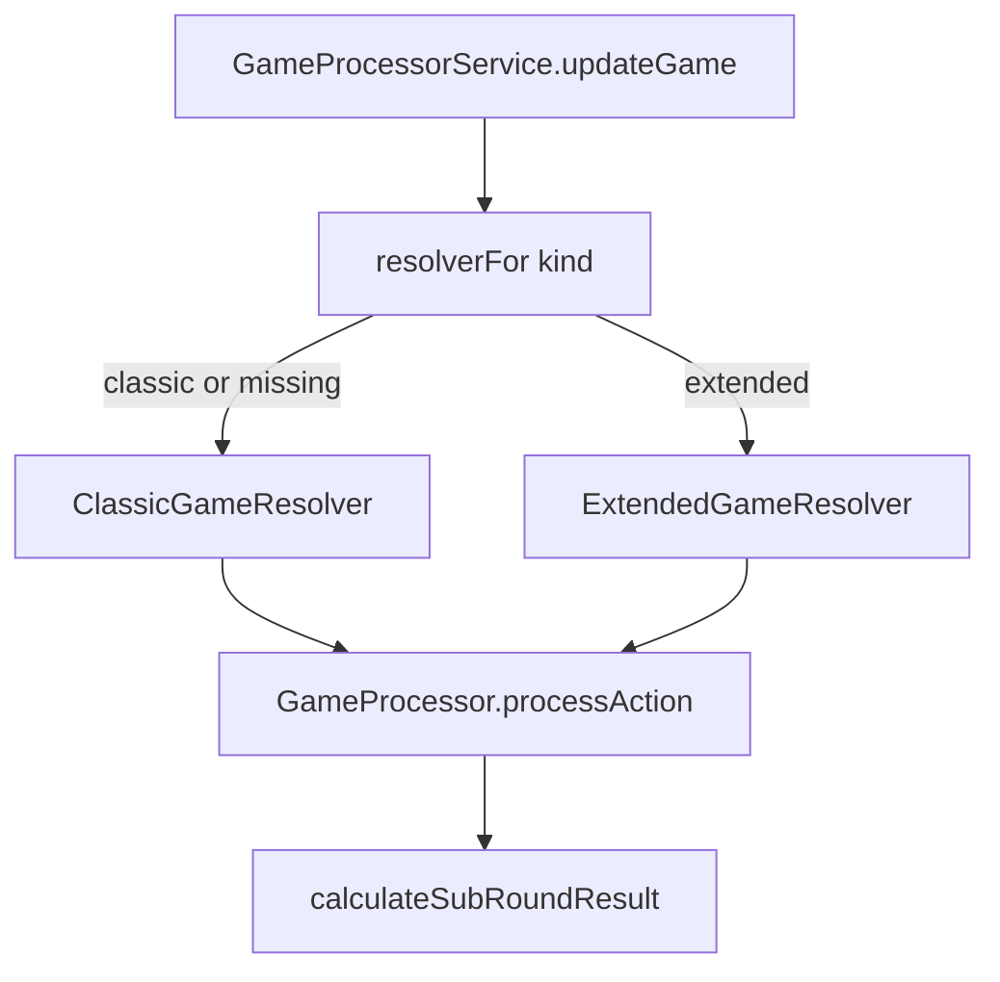

# Extended kind: size tie-break on equal MoveType

Implemented. Player API selects a `GameResolver` from `createContext.kind`. Classic RPS and round/surrender/victory flow stay in `GameProcessor`.

## Rule

When both throws have the **same** `MoveType`:

- **Classic** (or missing kind on old games): always a draw; `size` unused
- **Extended**: **higher `MoveContext.size` wins** the sub-round (round finishes, same as a Classic RPS win); **equal size is a draw** (no `winnerId`, new sub-round on the same round)

When MoveTypes **differ**, Classic RPS still applies and **size is ignored** (Paper 1 beats Stone 100).

## Why not two full processors

`GameProcessor` owns round/sub-round lifecycle, surrender, best-of victory (`createContext.rounds`), and NPC turn-taking. None of that changes for Extended.

The only rule that changes is `calculateSubRoundResult`. Keep **one processor**, inject **kind-specific resolvers**.

## What landed

- `GameResolver` interface; shared RPS helpers in `rps.ts`
- `ClassicGameResolver` and `ExtendedGameResolver`
- `GameProcessorService.resolverFor` / `processorFor` on each `updateGame`
- Extended NPC random size `0..10` (`NPC_EXTENDED_MAX_SIZE`); Classic NPC stays `size: 0`

## Out of scope

- New MoveTypes, `decorId` in win logic, rewards, or changing best-of / surrender
- Admin CRUD (`GameService`) — it does not run RPS
