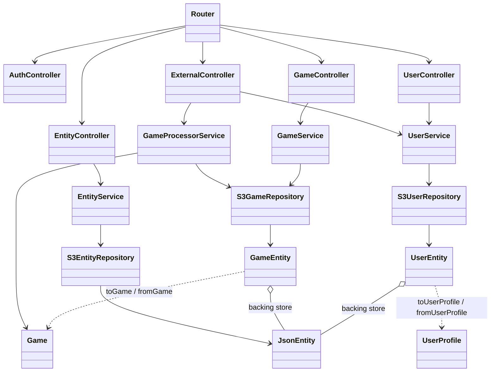
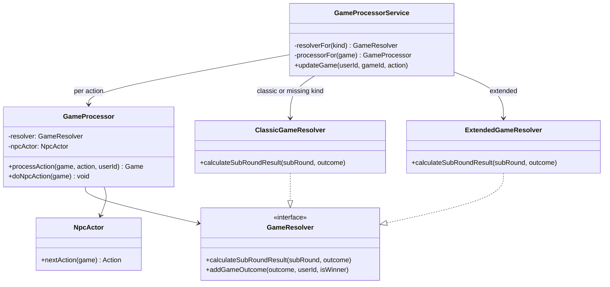
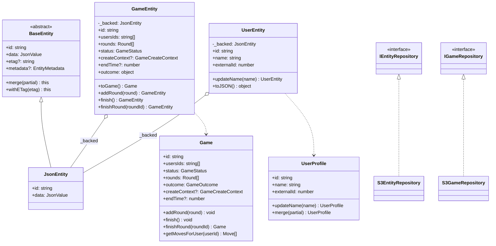
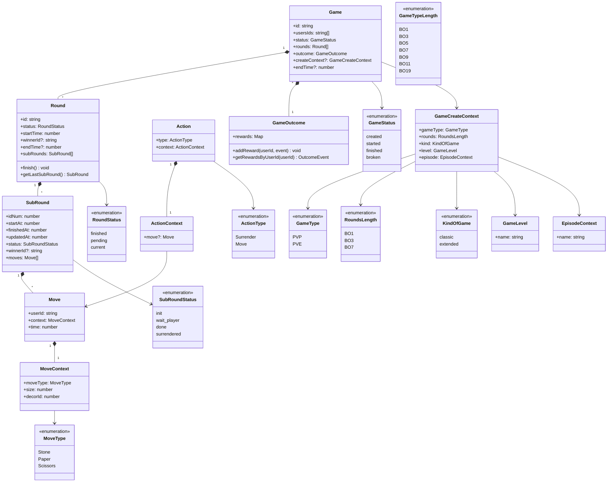
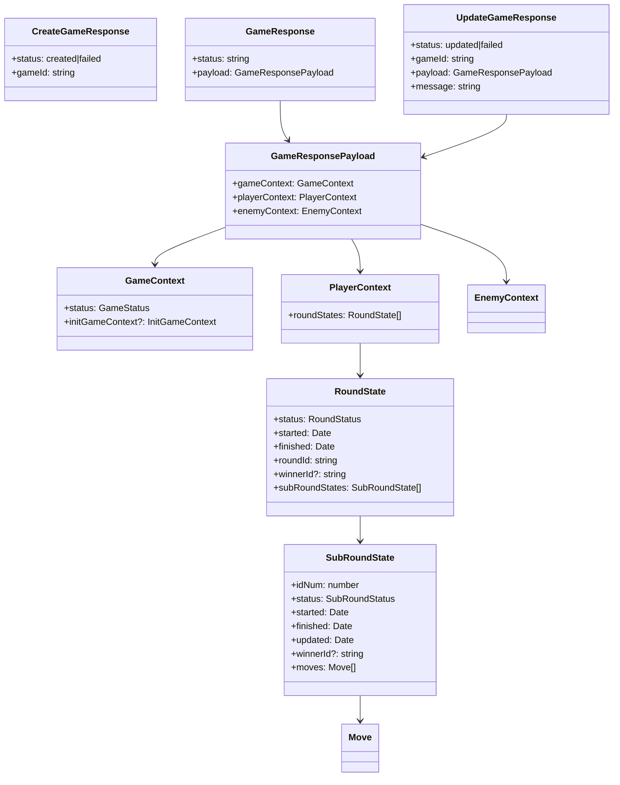

# API v2 class diagrams

Source of truth for domain types under `apiv2/src/domain`. HTTP contracts: [API_DOCUMENTATION.md](../../API_DOCUMENTATION.md). Runtime create/play/surrender flow: [GAME_FLOW.md](GAME_FLOW.md). Rewards detail: [GameOutcome-diagram.md](value-object/GameOutcome-diagram.md).

## Layers

`/apiv2/external/games` goes through `GameProcessorService` (create context + `Action`). `/apiv2/internal/games` goes through `GameService` (admin CRUD + ETag).

## Resolvers (player API)

`GameProcessorService.resolverFor(kind)` picks a `GameResolver` per action. Missing `createContext.kind` is Classic. Round/surrender/best-of stay in `GameProcessor`. `NpcActor.nextAction` decides whether the NPC throws and builds that `Action`; `doNpcAction` only applies it.

Classic: same `MoveType` is always a draw; `size` unused. Extended: same type compares `size` (higher wins, equal draw); different types still use Classic RPS.

## Persistence (delegating backing store)

`UserEntity` and `GameEntity` do not extend `BaseEntity`. Each wraps a `JsonEntity` for S3 JSON + ETag, and delegates rules to a pure domain object.

`User` is an alias of `UserEntity`.

## Game aggregate

Stored shape: `Game` → `Round[]` → `SubRound[]` → `Move[]`. Moves are not children of `Round`. `Game.addMoveToRound` throws; add moves on a `SubRound`.

`RoundsLength` is the create-context field (`BO1` / `BO3` / `BO7`) used for victory. `GameTypeLength` is used by `Medal.gameLength`, not stored on `Game`.

`KindOfGame.classic` uses `ClassicGameResolver` (same `MoveType` is always a draw; `size` unused). `KindOfGame.extended` uses `ExtendedGameResolver` (same type: higher `size` wins, equal size is a draw; different types ignore `size`).

## Processor responses (external games)

Admin `GameResponseDto` still flattens every `SubRound.moves` onto the round and maps `status` to `isFinished`. The processor payload keeps `subRoundStates`.
