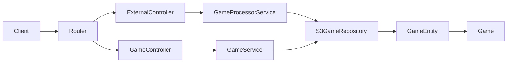
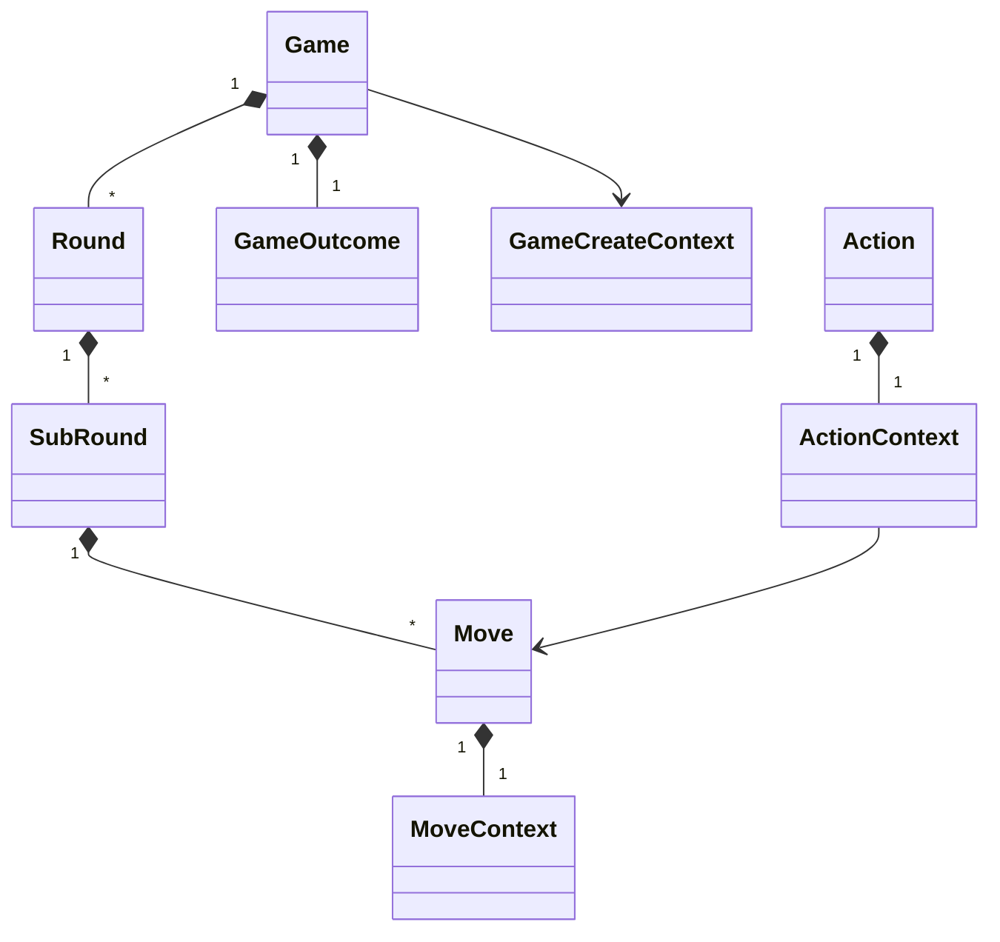
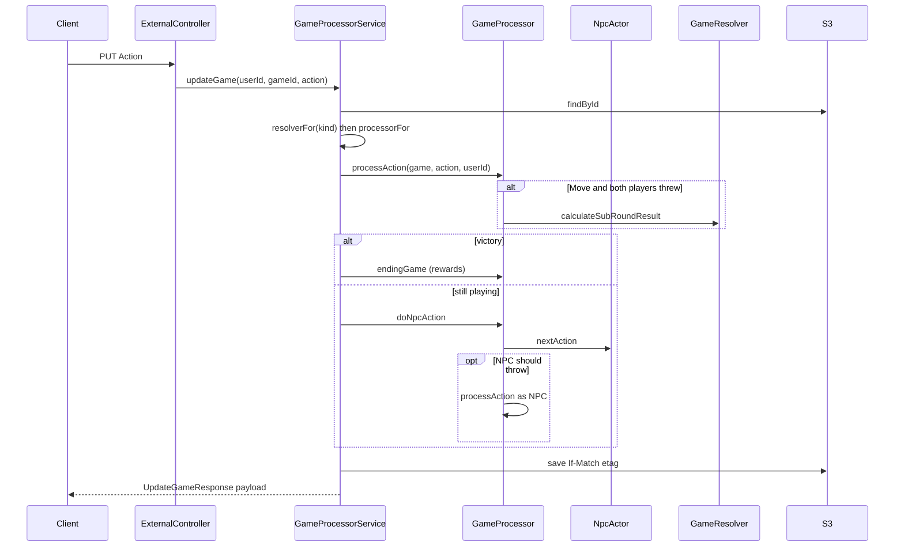

# Class diagrams and game flow

Companion to [CLASS_DIAGRAM.md](CLASS_DIAGRAM.md) (domain types) and [API_DOCUMENTATION.md](../../API_DOCUMENTATION.md) (HTTP contracts). Rewards detail: [GameOutcome-diagram.md](value-object/GameOutcome-diagram.md).

The class diagram is a map of **how objects are stored**. This document is **how those objects change** when a player creates a match and plays rock-paper-scissors against `NPC_1`.

Primary code: `GameProcessorService`, `GameProcessor`, `NpcActor`, `GameResolver` (`ClassicGameResolver`, `ExtendedGameResolver`).

## Two APIs, two services

HTTP hits a controller, then a service, then S3. Games have **two paths** that must not be mixed.



| Path | Service | Role |
|---|---|---|
| `/apiv2/external/games` | `GameProcessorService` | Player API: create, poll, play via `Action` |
| `/apiv2/internal/games` | `GameService` | Admin CRUD + ETag. Does **not** run RPS rules |

`GameProcessorService` is the live engine. `GameService` stores and updates JSON; it still has `addMoveToRound`, but the domain throws — moves belong on a `SubRound`.

## Persistence: `Game` vs `GameEntity`

`Game` is the domain aggregate (rules, rounds, outcome). `GameEntity` is the S3 wrapper.

- `JsonEntity` extends `BaseEntity` and holds `id`, JSON `data`, and `etag`.
- `GameEntity` **does not** extend `BaseEntity`. It **owns** a `JsonEntity` (`_backed`) and maps to/from `Game`.
- Same pattern for users: `UserEntity` wraps `JsonEntity` and maps to `UserProfile`.

Saves use ETags: create with `If-None-Match: *`, update with `If-Match` from the load. That is optimistic concurrency for S3.

`GameEntity.toGame()` / `fromGame` is the boundary. Processor logic always mutates a `Game`, then wraps it back into `GameEntity` to persist.

## Game aggregate (what is stored)

Stored shape:

**`Game` → `Round[]` → `SubRound[]` → `Move[]`**

Moves are **not** children of `Round`. `Game.addMoveToRound` throws. A round is a best-of series of throws; a sub-round is one throw vs throw.



### `Game`

- `id`, `usersIds` (player + `NPC_1` on create)
- `status`: `created` | `started` | `finished` | `broken`
- `createContext`: how the player asked to play
- `outcome`: rewards map, filled at game end
- `endTime` when finished

### `GameCreateContext`

Create payload, echoed in GET as `initGameContext`:

- `gameType`: `PVP` | `PVE` (create always seats `NPC_1` anyway)
- `rounds`: `BO1` | `BO3` | `BO7` — this is what victory uses
- `kind`: `classic` | `extended` — selects the sub-round resolver (`ClassicGameResolver` vs `ExtendedGameResolver`). Missing kind on old games is Classic.
- `level`, `episode`: campaign metadata

### `Round`

One “set” toward best-of:

- `id` like `round-1`
- `status`: `pending` → `current` → `finished`
- `winnerId` when a sub-round produces a winner (draws do not finish the round)

### `SubRound`

One throw pair:

- `idNum` 1, 2, 3…
- `status`: `init` → `wait_player` → `done`, or `surrendered`
- `moves`: 0, 1, or 2
- `winnerId` only on a decisive throw; **draw leaves `winnerId` unset** and the round stays current

### `Move`

- `userId`, `time`
- `MoveContext`: `moveType` (`Stone` | `Paper` | `Scissors`), `size`, and `decorId`
- `size` is unused in Classic. In Extended, equal `MoveType` compares `size` (higher wins; equal is a draw). Different types ignore `size`. `decorId` is visual only.

### `Action`

Player command, not stored as its own entity:

- `Move` — body includes a `Move`
- `Surrender` — opponent wins remaining rounds until the best-of threshold

## Status machines

### Game

```
created ──(first play in theory)──► started ──► finished
                                      │
                                      └──► broken
```

`initGameFromContext()` is supposed to flip `created` → `started`, but **nothing calls it**. Play still works: `processAction` allows moves on `created`. Live games often stay `created` until they become `finished`.

### Sub-round (one throw)

```
init  --player move-->  wait_player  --second move-->  done
                                              (or draw: still done, no winner)
surrendered  (surrender path)
```

### Round

- Created `pending`, then set `current` on first move.
- Finished only when a **sub-round has a `winnerId`** (a decisive throw, not a draw).
- Draws spawn a **new sub-round** on the next move; the same round continues.

### Game victory

From `createContext.rounds`:

| Requested | Max rounds | Wins needed |
|---|---|---|
| BO1 | 1 | 1 |
| BO3 | 3 | 2 |
| BO7 | 7 | 4 |

Formula: `Math.trunc(totalRounds / 2) + 1`.

## Runtime flow (external player API)

### 1. Create — `POST /apiv2/external/games`

Body is `GameCreateContext` JSON. JWT supplies `userId`.

`GameProcessorService.createGame`:

1. Builds `game-{timestamp}-{random}`
2. Sets `usersIds = [userId, 'NPC_1']`
3. Builds `Game` with `type = BO7`, `status = created`, empty `rounds`, empty `GameOutcome`
4. Saves `GameEntity` with `ifNoneMatch: '*'`
5. Returns `{ status: "created", gameId }`

No rounds yet. First throw creates them.

### 2. Poll — `GET /apiv2/external/games/:gameId`

Loads the entity, checks the caller is in `usersIds` (otherwise 404), maps to a **processor payload** (not the admin DTO):

- `gameContext.status` + `initGameContext` (copy of create settings)
- `playerContext.roundStates[]` with nested `subRoundStates[]` and `moves`
- `enemyContext` is currently empty `{}`

Admin `GameResponseDto` still flattens all sub-round moves onto the round and maps status to `isFinished`. The player payload keeps the nested shape.

### 3. Play — `PUT/PATCH /apiv2/external/games/:gameId`

Body is an `Action`. Repository path:



Finished/broken games return `status: failed` with a message. Otherwise the updated nested payload is returned.

## What `processAction` does

Guards: reject `finished`/`broken`; caller must be in `usersIds`.

### Move

1. If there is no round, or the last round is `finished`, `addRound()`:
   - id `round-N`
   - status `pending`, then immediately `current`
   - one empty `SubRound` (`idNum` 1, status `init`)
2. If the last sub-round is `done`, open a new sub-round (draw continuation or next throw).
3. `addMoveToSubRound`:
   - reject a second throw by the same user (`ValidationError: Second turn in sub round`)
   - `init` → `wait_player` after the first throw
   - when **2 moves** exist: `GameResolver.calculateSubRoundResult` (Classic or Extended from `createContext.kind`)
4. RPS: Stone beats Scissors, Paper beats Stone, Scissors beats Paper.
   - **Classic** (or missing kind): same types → draw, no `winnerId`; `size` unused.
   - **Extended**: same types → higher `size` wins the sub-round; equal `size` is a draw. Different types ignore `size`.
5. If the sub-round has a `winnerId`, the **round** is finished with that winner.
6. If that user’s finished-round count hits the threshold, `game.status = finished`.

NPC is **not** inside `processAction`. After a human move, `updateGame` calls `doNpcAction` unless victory is already reached.

### NPC (`NpcActor` + `doNpcAction`)

`NpcActor.nextAction` returns a Move `Action` only if:

- game is not finished/broken
- some `usersIds` starts with `NPC_`
- last round is not finished
- last sub-round is `init` or `wait_player`
- NPC has not already thrown in that sub-round

Otherwise it returns `null`. Classic NPC uses `size: 0`. Extended NPC uses a random integer `0..10` so same-type size can decide.

`GameProcessor.doNpcAction` applies that action via `processAction`. Typical PVE: player throws → sub-round `wait_player` → NPC throws → resolve → maybe new round.

### Surrender

1. Current `current` round: drop `wait_player` sub-rounds, add a `surrendered` sub-round, opponent wins the round.
2. Keep adding finished surrendered rounds until `isVictoryAchieved`.
3. `endingGame`: `finished` + `endTime` + rewards.

## Outcomes / rewards

`Game.outcome` is a `Map<userId, OutcomeEvent>`.

| Event | When | Points |
|---|---|---|
| Round win | `addRoundOutcome` | +1 Experience — **event is built but never attached** to `outcome` |
| Game win | `endingGame` → `addGameOutcome` | +1 Wins, +30 Experience, +1 Games |
| Game loss | same | +10 Experience, +1 Games |

`endingGame` is called from `updateGame` when victory is already true after `processAction` (including surrender, which also calls it internally). `processAction` on a Move that finishes the game sets `status`/`endTime` but **does not** attach rewards; the service’s second `endingGame` does.

User profiles are **not** updated from outcome yet (`todo update users by outcome`).

## Mental model of one BO3 PVE game

1. **Create** — empty game, `created`, `usersIds = [you, NPC_1]`, `createContext.rounds = BO3` (need 2 round wins).
2. **Your first throw** — `round-1` + sub-round 1, status `wait_player`.
3. **NPC throw** — two moves; resolver sets winner or draw.
4. **Draw** — sub-round `done`, no round winner. Your next throw opens sub-round 2 on the **same** round.
5. **You win the throw** — round finishes. If you have 2 round wins, game finishes and rewards are written. Else a new round starts on the next move.
6. **GET** always returns nested `roundStates` / `subRoundStates` for the client UI.

## Quirks

1. **`KindOfGame`** selects the resolver on each `updateGame`. Classic: same `MoveType` is always a draw. Extended: same type uses `size` (higher wins, equal draw). Different types always use Classic RPS.
2. **`started` is unused in the live path** — `initGameFromContext` exists but is never called.
3. **Admin vs player DTO** — internal games flatten moves onto rounds; external keeps `subRoundStates`.
4. **Round-level XP is a no-op** — `addRoundOutcome` does not call `outcome.addReward`.
