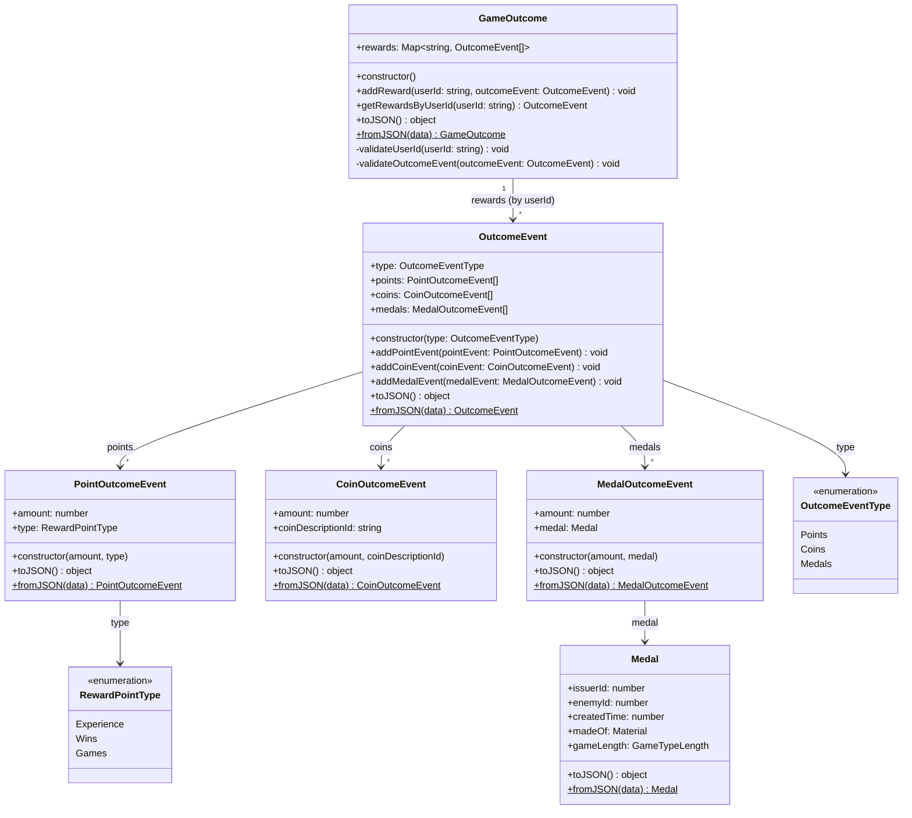

# GameOutcome Class Diagram



## Structure Overview

```
┌─────────────────────────────────────────────────────────────────────────┐
│                           GameOutcome                                    │
├─────────────────────────────────────────────────────────────────────────┤
│  rewards: Map<string, OutcomeEvent[]>                                    │
│     └── userId → [OutcomeEvent, OutcomeEvent, ...]                       │
├─────────────────────────────────────────────────────────────────────────┤
│  + addReward(userId, outcomeEvent)                                       │
│  + getRewardsByUserId(userId) → OutcomeEvent  (aggregated)                │
│  + toJSON() / fromJSON()                                                  │
└─────────────────────────────────────────────────────────────────────────┘
                                    │
                                    │ 1..* per userId
                                    ▼
┌─────────────────────────────────────────────────────────────────────────┐
│                          OutcomeEvent                                    │
├─────────────────────────────────────────────────────────────────────────┤
│  type: OutcomeEventType (POINTS | COINS | MEDALS)                         │
│  points: PointOutcomeEvent[]                                              │
│  coins: CoinOutcomeEvent[]                                                │
│  medals: MedalOutcomeEvent[]                                              │
├─────────────────────────────────────────────────────────────────────────┤
│  + addPointEvent / addCoinEvent / addMedalEvent                          │
└─────────────────────────────────────────────────────────────────────────┘
         │                    │                    │
         ▼                    ▼                    ▼
┌──────────────────┐ ┌──────────────────┐ ┌──────────────────┐
│ PointOutcomeEvent│ │ CoinOutcomeEvent │ │MedalOutcomeEvent  │
├──────────────────┤ ├──────────────────┤ ├──────────────────┤
│ amount: number   │ │ amount: number   │ │ amount: number   │
│ type: RewardPoint│ │ coinDescriptionId│ │ medal: Medal     │
│   Type           │ │   : string       │ │                  │
└──────────────────┘ └──────────────────┘ └────────┬─────────┘
       │                                              │
       ▼                                              ▼
┌──────────────────┐                         ┌──────────────┐
│ RewardPointType  │                         │    Medal     │
│ EXPERIENCE       │                         │ issuerId     │
│ WINS             │                         │ enemyId      │
│ GAMES            │                         │ createdTime  │
└──────────────────┘                         │ madeOf       │
                                             │ gameLength   │
                                             └──────────────┘
```

## getRewardsByUserId aggregation logic

- **Points**: grouped by `RewardPointType`, amounts summed → one `PointOutcomeEvent` per type
- **Coins**: grouped by `coinDescriptionId`, amounts summed → one `CoinOutcomeEvent` per description
- **Medals**: all collected (no aggregation)
