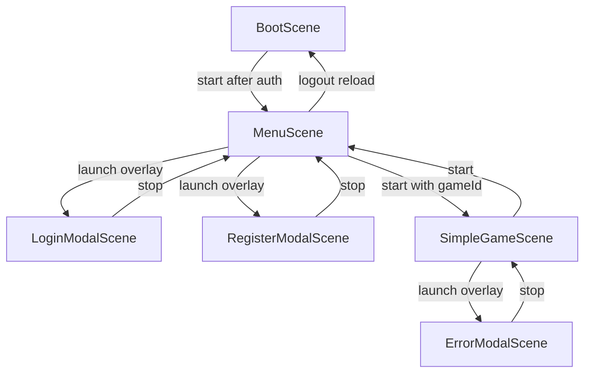

# html5Simple scenes

Phaser scenes in [`js/game.js`](js/game.js). Layout (`?layout=`) and FX (`?fx=`) are independent. Canvas size and other debug labels show only with `?debug=1`.

## Scene list

| Scene | File | Kind | Player copy |
|-------|------|------|-------------|
| BootScene | [`js/scenes/BootScene.js`](js/scenes/BootScene.js) | Full screen | Title **Sweet Adventure**. Subtitle **Getting ready...**, then **Tap to continue** after auth. |
| MenuScene | [`js/scenes/MenuScene.js`](js/scenes/MenuScene.js) | Full screen | Title **Sweet Adventure**. Subtitle **Pick a match**. Player name in the corner. Buttons: LOGIN, REGISTER, LOGOUT, INVENTORY (stub), START GAME, EXIT (stub). |
| LoginModalScene | [`js/scenes/LoginModalScene.js`](js/scenes/LoginModalScene.js) | Overlay | Title **LOGIN**. Subtitle **Sign in to keep your games**. |
| RegisterModalScene | [`js/scenes/RegisterModalScene.js`](js/scenes/RegisterModalScene.js) | Overlay | Title **Create account**. Subtitle **Save this guest as a real player**. Fields reset on each open. |
| ErrorModalScene | [`js/scenes/ErrorModalScene.js`](js/scenes/ErrorModalScene.js) | Overlay | Caller title and message (for example **Move Failed**). OK closes. |
| SimpleGameScene | [`js/scenes/SimpleGameScene.js`](js/scenes/SimpleGameScene.js) | Full screen | Status: **Loading match...** · **Pick Stone, Scissors, or Paper** · **{move} ready — tap GO** · **Sending {move}...** · **Match over**. BACK returns to menu. |

Inventory and Exit are still stubs (no scenes). Logout reloads the page so Boot can mint a new guest token.

## Transitions

Helpers in [`js/uiFx.js`](js/uiFx.js). Duration comes from the active FX preset in [`js/frameSize.js`](js/frameSize.js) (`?fx=quiet|casual|arcade`). No separate transition switcher.

| From | To | Motion |
|------|----|--------|
| Boot | Menu | Fade. Auth, then min hold ~800ms, tap to skip after auth. Arcade also flashes. |
| Menu | Game | Fade after create-game succeeds. START GAME shows **STARTING...**. Arcade also flashes. |
| Game | Menu | Fade (BACK). |
| Menu | Login / Register | Overlay fade + card pop. Parent scene input is paused. |
| Login / Register | Menu | Card pop-out, then stop. |
| Game | Error | Overlay fade + card pop. Parent scene input is paused. |
| Error | Game | Card pop-out, then stop. |

| FX preset | Fade | Modal pop | Flash on Boot→Menu and Menu→Game |
|-----------|------|-----------|----------------------------------|
| Quiet (`?fx=quiet`) | 80ms | Opacity only | No |
| Casual (`?fx=casual`) | 180ms | Pop | No |
| Arcade (`?fx=arcade`) | 280ms | Pop | Yes |
