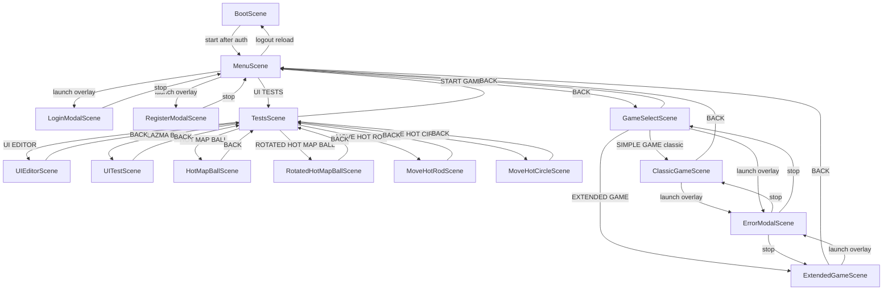

# html5Simple scenes

Phaser scenes in [`js/game.js`](js/game.js). Layout (`?layout=`) and FX (`?fx=`) are independent. Canvas size and other debug labels show only with `?debug=1`.

ClassicGameScene and ExtendedGameScene extend [`GamePlayScene`](js/scenes/GamePlayScene.js), which owns layout, HUD, Stage, scores, and GO. Subclasses only set move size and cancel rules.

## Scene list

| Scene | File | Kind | Player copy |
|-------|------|------|-------------|
| BootScene | [`js/scenes/BootScene.js`](js/scenes/BootScene.js) | Full screen | Title **Sweet Adventure**. Subtitle **Getting ready...**, then **Tap to continue** after auth. |
| MenuScene | [`js/scenes/MenuScene.js`](js/scenes/MenuScene.js) | Full screen | Title **Sweet Adventure**. Subtitle **Pick a match**. Player name in the corner. Buttons: LOGIN, REGISTER, LOGOUT, INVENTORY (stub), START GAME, UI TESTS, EXIT (stub). Bottom **SKIN IN/OFF**: **IN** fills the menu background with the heat-map preset ([`resources/ui-editor-init.json`](resources/ui-editor-init.json)) and cuts the button labels out of a black fill so the heat map shows through the letters; **OFF** keeps the blank background and outline buttons. |
| GameSelectScene | [`js/scenes/GameSelectScene.js`](js/scenes/GameSelectScene.js) | Full screen | Title **Sweet Adventure**. Subtitle **Choose a game**. Buttons: SIMPLE GAME (classic), EXTENDED GAME, BACK. |
| TestsScene | [`js/scenes/TestsScene.js`](js/scenes/TestsScene.js) | Full screen, **780×844** (2× game width) | Title **Tests**. Subtitle **Pick a sandbox**. Buttons: UI EDITOR, UI PLAZMA BALL, HOT MAP BALL, ROTATED HOT MAP BALL, MOVE HOT ROD, MOVE HOT CIRCLE, BACK. Entering this hub widens the Phaser canvas; child sandboxes use that width. BACK to Menu restores **390×844**. |
| UIEditorScene | [`js/scenes/UIEditorScene.js`](js/scenes/UIEditorScene.js) | Full screen | Title **UI Editor**. Four equal panes. **STAGE** hosts one [`UiHeatMap`](js/ui/UiHeatMap.js) with three [`UiHotBall`](js/ui/UiHotBall.js) and three [`UiHotRod`](js/ui/UiHotRod.js) emitters that stamp into it. **EFFECTS** edits the map (DIFFUSE, COOL) and **PLAY** / **STEP** / **STOP** the stepper. **OBJECTS** selects a ball or rod and **SAVE** / **LOAD** a local JSON preset. **PROPS** edits that object: balls (VISIBLE, DOT SIZE/HEAT, GEO including PHASE and live CENTER X/Y) or rods (VISIBLE, LINE HEAT, GEO, MOVE with START/END X% Y% from −200 to 200, START/END ANG, DELAY at end, GAP at start). Each rod eases start pose → end pose, waits DELAY, snaps back to start, waits GAP, then repeats. Tap Stage to move the selected object. BACK returns to Tests. |
| LoginModalScene | [`js/scenes/LoginModalScene.js`](js/scenes/LoginModalScene.js) | Overlay | Title **LOGIN**. Subtitle **Sign in to keep your games**. |
| RegisterModalScene | [`js/scenes/RegisterModalScene.js`](js/scenes/RegisterModalScene.js) | Overlay | Title **Create account**. Subtitle **Save this guest as a real player**. Fields reset on each open. |
| ErrorModalScene | [`js/scenes/ErrorModalScene.js`](js/scenes/ErrorModalScene.js) | Overlay | Caller title and message (for example **Move Failed**). OK closes. |
| ClassicGameScene | [`js/scenes/ClassicGameScene.js`](js/scenes/ClassicGameScene.js) | Full screen | Status: **Loading match...** · **Pick Stone, Scissors, or Paper** · **{move} ready — tap GO** · **Sending {move}...** · **Match over**. BACK returns to menu. GO sends `size: 0`. |
| ExtendedGameScene | [`js/scenes/ExtendedGameScene.js`](js/scenes/ExtendedGameScene.js) | Full screen | Same layout as classic, plus **EffectsPanel** (buttons **NEG**, **OVER**, **PROT**, **SIZE**) under the current-move status. First tap on a type selects it at size 1 (`STONE 1`). Same tap increments (max 10). Status: **{move} {size} ready — tap GO**. GO sends that size and the selected effects (`effects[]`). At most one size effect and one type effect; tapping a second in the same category replaces the first. Round tiles show the player's used size. Cancel is inactive until a type is selected; at size 1 it clears the type; at size 2+ it shows **MINUS** and decrements size. |
| UITestScene | [`js/scenes/UITestScene.js`](js/scenes/UITestScene.js) | Full screen | Title **UI plazma ball**. Subtitle **Yellow ball test**. **TestPanel** plays a yellow plasma ball on a deep blue field ([`PlasmaBallFx`](js/fx/PlasmaBallFx.js)). Tap the panel and the ball orbits that point at **3 ball sizes**; the orbit center eases to each new tap. BACK returns to Tests. |
| HotMapBallScene | [`js/scenes/HotMapBallScene.js`](js/scenes/HotMapBallScene.js) | Full screen | Title **Hot map ball**. Subtitle **Heat map test**. **TestPanel** starts black. Tap drops a hot dot; heat diffuses into neighboring pixels and brightness follows temperature ([`HeatMapFx`](js/fx/HeatMapFx.js)). **SettingsPanel** has **− / +** steppers for **DIFFUSE**, **COOL**, **DOT SIZE**, **DOT HEAT**. BACK returns to Tests. |
| RotatedHotMapBallScene | [`js/scenes/RotatedHotMapBallScene.js`](js/scenes/RotatedHotMapBallScene.js) | Full screen | Title **Rotated hot map ball**. Subtitle **Orbiting heat test**. A hot ball wanders, then orbits a tap in a tilted plane (ellipse path) ([`RotatedHeatMapFx`](js/fx/RotatedHeatMapFx.js)). **SettingsPanel** has tabs **HEAT** (DIFFUSE, COOL, DOT SIZE, DOT HEAT) and **GEO** (ANG SPEED, RADIUS, TILT X/Y/Z). BACK returns to Tests. |
| MoveHotRodScene | [`js/scenes/MoveHotRodScene.js`](js/scenes/MoveHotRodScene.js) | Full screen | Title **Move hot rod**. Subtitle **Tap to move the line**. A hot line spans the panel (looks infinite); a tap eases it along the direction orthogonal to **ANGLE**. GEO **ANGLE** rotates it in 2D. Emission is noisy ([`HotRodFx`](js/fx/HotRodFx.js)). **SettingsPanel** has tabs **HEAT** (DIFFUSE, COOL, LINE HEAT) and **GEO** (THICKNESS, ANGLE, SPEED, NOISE, GRAIN, FLICKER). BACK returns to Tests. |
| MoveHotCircleScene | [`js/scenes/MoveHotCircleScene.js`](js/scenes/MoveHotCircleScene.js) | Full screen | Title **Move hot circle**. Subtitle **Tap to move the circle**. A hot ring sits on the heat field; a tap eases its center to the tap. GEO **RADIUS**, **THICKNESS**, and **TILT X/Y/Z**. **WIND** blows the heat and **X SPEED** scrolls every cell horizontally ([`HotCircleFx`](js/fx/HotCircleFx.js)). **SettingsPanel** tabs **HEAT**, **GEO**, **WIND**. BACK returns to Tests. |

Inventory and Exit are still stubs (no scenes). Logout reloads the page so Boot can mint a new guest token.

## Transitions

Helpers in [`js/uiFx.js`](js/uiFx.js). Duration comes from the active FX preset in [`js/frameSize.js`](js/frameSize.js) (`?fx=quiet|casual|arcade`). No separate transition switcher.

| From | To | Motion |
|------|----|--------|
| Boot | Menu | Fade. Auth, then min hold ~800ms, tap to skip after auth. Arcade also flashes. |
| Menu | Game select | Fade. Arcade also flashes. |
| Menu | Tests | Fade (UI TESTS). |
| Tests | Menu | Fade (BACK). |
| Tests | UI editor | Fade (UI EDITOR). |
| Tests | UI test | Fade (UI PLAZMA BALL). |
| Tests | Hot map | Fade (HOT MAP BALL). |
| Tests | Rotated hot map | Fade (ROTATED HOT MAP BALL). |
| Tests | Move hot rod | Fade (MOVE HOT ROD). |
| Tests | Move hot circle | Fade (MOVE HOT CIRCLE). |
| Game select | Menu | Fade (BACK). |
| UI editor | Tests | Fade (BACK). |
| UI test | Tests | Fade (BACK). |
| Hot map | Tests | Fade (BACK). |
| Rotated hot map | Tests | Fade (BACK). |
| Move hot rod | Tests | Fade (BACK). |
| Move hot circle | Tests | Fade (BACK). |
| Game select | Classic / Extended | Fade after create-game succeeds. Chosen button shows **STARTING...**. Arcade also flashes. |
| Classic / Extended | Menu | Fade (BACK). |
| Menu | Login / Register | Overlay fade + card pop. Parent scene input is paused. |
| Login / Register | Menu | Card pop-out, then stop. |
| Classic / Extended / Game select | Error | Overlay fade + card pop. Parent scene input is paused. |
| Error | Classic / Extended / Game select | Card pop-out, then stop. |

| FX preset | Fade | Modal pop | Flash on Boot→Menu, Menu→Game select, and Game select→play |
|-----------|------|-----------|----------------------------------|
| Quiet (`?fx=quiet`) | 80ms | Opacity only | No |
| Casual (`?fx=casual`) | 180ms | Pop | No |
| Arcade (`?fx=arcade`) | 280ms | Pop | Yes |
